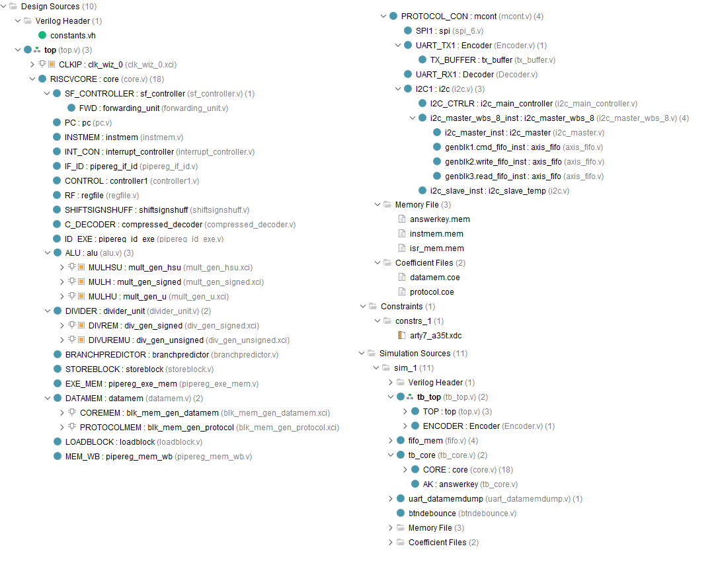

# Pipelined RV32IMC: Capstone Project for CoE 198 (2SAY1920)
This project uses Xilinx IP modules available in Vivado. The design was verified using **Vivado 2019.2**

#### Project Members
+ Emman Baylosis
+ Phoebe Chua
+ MJ Neri
+ Red Ridao
+ Allen Tan

## Processor Specifications and Features
Features | Specifications
---- | ----
**Architecture** | RV32IMC
**Operating Frequency** | 50MHz
**Memory** | 12kB
**Pipeline stages** | 5-stage In-order Pipeline
**Hazard Handling** | Data Forwarding & Bimodal Branch Prediction
**Multiplication Latency** | 1 clock cycle
**Division Latency** | 38-46 cycles
**Branch Prediction** | 64-Entry Branch History Table w/ Branch Target Buffer
**Branch/Jump Misprediction Penalty** | 2 cycles
**FPGA Used** | Arty-A7 35
**Supported Communication Protocols** | UART, SPI, I2C (memory-mapped)


## Simplified Processor Block Diagram
<p align="center">
  
</p>

## Data Memory Organization
<p align="center">
  
</p>

## Quickstart
+ Add **board-files/arty-a7-35** to your Vivado Installation Directory. README.txt contains specific directory.
+ Create a project in Vivado. Set project name based on your preference, then just click next until you have to choose a default part.
+ In Boards, select **Arty A7-35** (part: *xc7a35ticsg324-1L*)
+ Run **project_run.tcl** to add all source files to the project (see section below).
+ Double check design hierarchy to see if it matches the design hierarchy shown below.
+ To generate dump files for assembly-tests, use **dumpgen_script.py**

### Using project_run.tcl
+ Execute using **Tools > Run Tcl Script...** in Vivado

## Vivado Project Design Hierarchy
<p align="center">
  
</p>

### Using assembler.py
```python
> py assembler\assembler.py <input_file.s> <output_file.dmp> -comp_buffer True
```

### Using dumpgen_script.py
+ Set terminal to directory of assembly code before running **dumpgen_script.py**
+ Edit `assembler_folder_path` in **dumpgen_script.py** using absolute path
+ [**RARS**](https://github.com/TheThirdOne/rars) is used to generate datamem dumps & answer keys
```python
> py dumpgen_script.py <input_file.s>
```

### Using Vivado ILA
+ Comment/uncomment `ila_ctr` in **top.v**
+ Comment/uncomment Vivado ILA section in the constraints file
